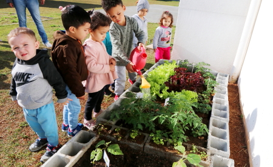

EDUCAÇÃO AMBIENTAL 

 

 

O compromisso do nosso projeto com o meio ambiente vai muito além apenas da venda de alimentos orgânicos, também vamos nos preocupar com os hábitos do dia a dia dos nossos funcionários e dos nossos clientes, buscando sempre influenciar positivamente em práticas que favorecem a educação ambiental, seguem exemplos de como faremos isso: 

 

Incentivo à Reciclagem: 

Pontos de coleta de reciclagem: Iremos instalar pontos de coleta de plásticos, papéis e outros materiais recicláveis no estabelecimento. 

Descarte de resíduos adequadamente: Ensinar os clientes sobre o descarte correto de materiais também é essencial, alcançaremos isso com sinalização adequada e programas de separação de lixo reciclável e orgânico. 

</img>

Figura disponível em: https://www.flaticon.com/br/icone-gratis/lixeira-de-reciclagem_7299445. 
 

Reduzir o consumo de plástico: 

Iremos incentivar o uso de sacolas reutilizáveis na compra de todos os nossos produtos. 

Evitaremos a venda de produtos com excesso de embalagens plásticas. 

Criaremos um programa de desconto para clientes que trouxerem suas próprias sacolas e recipientes reutilizáveis. 

Redução de Desperdício Alimentar 

Oferecemos produtos "feios" com desconto: Incentivando os clientes a comprar frutas e legumes fora do padrão estético tradicional, mas que ainda estão em boas condições de consumo, ajudando assim a reduzir o desperdício de alimentos. 

Doação de alimentos: Realizamos parcerias com instituições de caridade para doar produtos próximos à data de vencimento, mas ainda adequados para consumo. 

Compostagem: Realizaremos a implementação de um sistema de compostagem para restos de alimentos e incentivar os clientes a fazer o mesmo em suas casas, possivelmente talvez até oferecendo kits de compostagem. 

 

Parcerias Locais e Agricultura Sustentável 

Apoiar produtores locais: Priorizamos a compra de produtos de pequenos agricultores locais que utilizam práticas sustentáveis. 

Venda de produtos orgânicos: Venderemos uma variedade de produtos orgânicos informando os consumidores sobre os benefícios ambientais de consumir alimentos cultivados sem pesticidas e produtos químicos. 

 

Horta Comunitária 

Criação de uma horta no local: Construiremos uma horta comunitária, onde os clientes poderão participar e aprender sobre o cultivo sustentável de alimentos. Isso também servirá como fonte de produtos frescos para o próprio hortifruti. 

 

</img>

Figura disponível em: https://www.jacarei.sp.gov.br/projeto-maos-a-horta-incentiva-plantio-de-mudas-em-59-escolas-de-jacarei/. 

Por que tomar tais práticas? 

 Essas práticas são de extrema importância, pois, muitos dos problemas ambientais são causados por ações humanas, como o uso desenfreado de recursos naturais, a poluição industrial e o consumo excessivo. A degradação ambiental compromete os recursos disponíveis para as gerações futuras.  A educação ambiental ensina a importância de conservar a natureza para garantir que os recursos estejam disponíveis para todas as próximas gerações. 

 

Conclusão: 

 Com isso podemos chegar a conclusão de que a educação se tornou extremamente importante e fundamental para todo tipo de negócio nos dias atuais, pois, sem essa prática o uso desgovernado de recursos naturais pode agravar diversas consequências negativas em um futuro não tão distante. 

 Ao adotar essas práticas, estamos não apenas reduzindo impactos negativos no meio ambiente, mas também educando a comunidade sobre a importância da sustentabilidade.  

 A degradação ambiental é um desafio urgente, e apenas com a colaboração de indivíduos, empresas e governos será possível reverter esse cenário.  