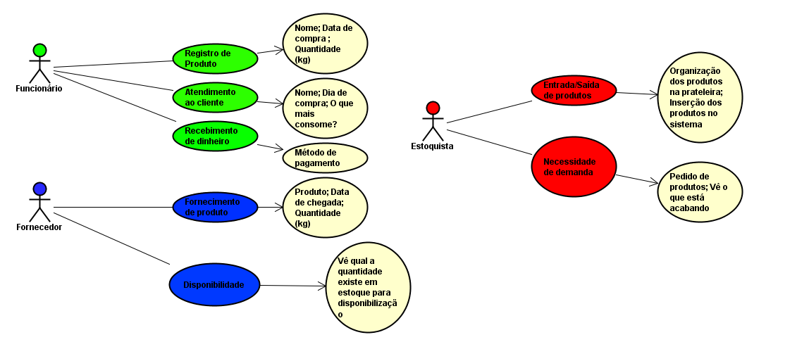

ENGENHARIA DE SOFTWARE I 

 

  

O gerenciamento e otimização tanto dos colaboradores, quanto das informações é de suma importância para um bom trabalho. Nesse projeto foi utilizado a metodologia ágil chamada SCRUM, que é composta pelas seguintes palavras em inglês: Sprint; Cycle; Review; Update e Meeting. Foi utilizado também o GitHub, em que é possível gerir e enviar códigos, além disso tem outras funções como, versionamento de dados, organização das ideias, etc. 

Para realizarmos esse projeto seguimos alguns artefatos, como o ciclo de vida clássica de um software, que consiste basicamente em: Levantamento ou elicitação dos requisitos (será perguntado ao cliente o que ele deseja ter em seu sistema). Nesse momento são determinados também os Requisitos Funcionais (são diretamente ligados ao que o cliente solicitou na elaboração dos requisitos) e Não Funcionais (não são ligadas ao que o cliente disse diretamente, por exemplo, quais funções serão utilizadas na hora da programação do sistema), Projeto do Sistema (nessa hora, será necessário decidir quais serão as ferramentas utilizadas e como será desenvolvido o sistema requerido); Programação (“hora de botar a mão na massa”, ou seja, é o momento de começar a programação do sistema); Teste (momento em que são conferidos todos os requisitos e se está tudo de acordo com o desejo do cliente); Operação ou Manutenção do Sistema (essa é a “parte final”, onde o sistema já passou pela verificação, e também será o treinamento dos usuários desse sistema). Com esses passos sendo seguidos e documentados, será mais fácil ter um bom relacionamento com o cliente. 

Outro artefato muito importante para a realização desse projeto foi o SCRUM (como mencionado anteriormente), foi utilizado para gerir as etapas a serem concluídas, entrando mais a fundo no Scrum temos os seguintes requisitos para uma boa gestão: Backlog, basicamente são os requisitos pedido pelo cliente; Sprint Backlog, momento em que o Backlog é o que será feito em determinado sprint/desenvolvimento de cada requisito solicitado  ; Sprint planning, o que será feito em determinado tempo, geralmente cada sprint duram entre 2 a 4 semanas; Daily Scrum, são reuniões diárias que serão estipuladas metas pequenas que devem ser cumpridas naquele determinado dia; Sprint Review, mostra o que foi feito em determinada sprint e se o objetivo maior (motivo da sprint) foi cumprido; e por fim Sprint Retrospective, mostra como foi o desenvolvimento do que o cliente solicitou, mostrando cada sprint e o que aconteceu nas mesmas.  

A seguir, vemos um esquema em que mostra como são feitos os requisitos designados a cada “personagem”, sendo eles funcionário, fornecedor e estoquista. 

</img>
Figura : Mostra a modelagem de caso de uso (UML). Feita por Gabriel Freitas, 2024. 