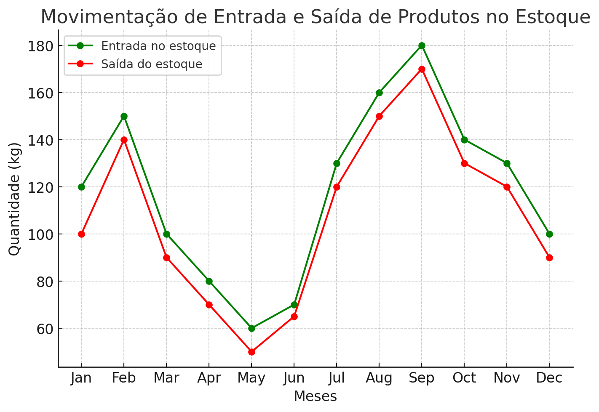
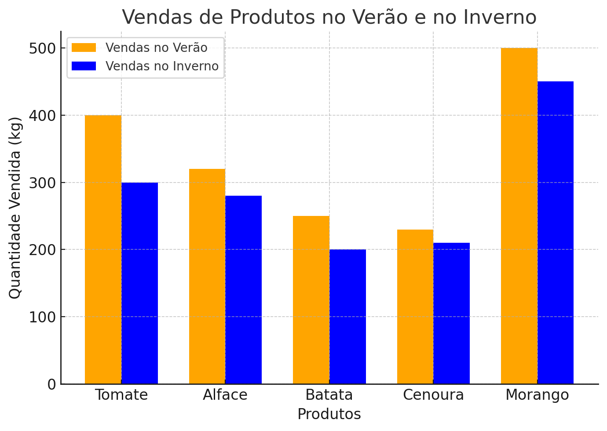

MATEMÁTICA PARA COMPUTAÇÃO

 Em resumo, se não fosse a matemática, seria impossível desenvolver um sistema de qualquer tipo. É a Matemática que fornece as ferramentas necessárias para a resolução de problemas e o desenvolvimento dos sistemas. Assim, sem uma base matemática, o desenvolvimento de um sistema eficiente é uma tarefa bastante difícil de efetuar. Afinal de contas, Álgebra Linear, probabilidade e estáticas e lógica matemática, são somente três dentre múltiplos aspectos matemáticos utilizados ao máximo para o desenvolvimento de um sistema.

A álgebra linear será extremamente útil na gestão do nosso sistema de hortifrúti. Principalmente o conceito de vetores, que será usado para representar e organizar os dados dos produtos e suas movimentações de entrada e saída do estoque, e também gerenciar o prazo de validade de cada produto, assim automatizando a gestão do estoque.
</img>

Outro conceito matemático útil para a gestão do hortifrúti são dados estatísticos. Com ele será possível otimizar, reduzir desperdícios de produtos e atender as demandas dos clientes do hortifrúti. Com a média de vendas de cada produto, conseguiremos estimar a demanda desse produto para o próximo mês, assim otimizando o espaço do estoque e também evitando possíveis futuros desperdícios de alimentos. Podemos também analisar as tendências de vendas no verão ou inverno, por exemplo.
</img>

Fator que será útil no abastecimento e reabastecimento do estoque, e no planejamento de promoções em determinados produtos com antecedência.
Por tanto, é evidente que a utilização desses conceitos em um sistema de um hortifrúti automatizado pode otimizar e potencializar a organização e a sua eficiência como um todo.
