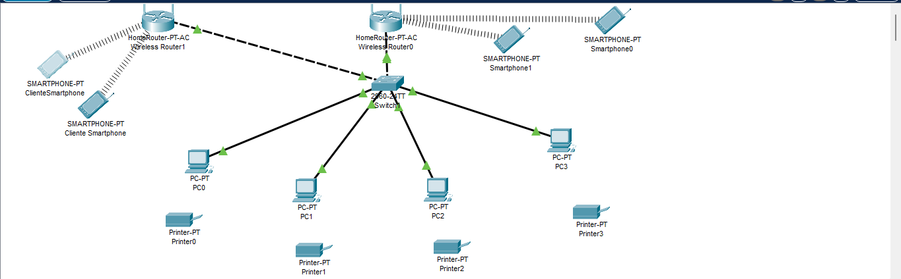

FUNDAMENTOS DE REDES DE DADOS E COMUNICAÇÃO 

Quando falamos de uma rede de dados para um Hortifrúti, o que devemos pensar é na relação entre funcionários, clientes e fornecedores que necessitam de uma boa comunicação.  

Então para que a rede seja construída temos fundamentos que precisam ser seguidos. Tais como: 

PROTOCOLO DE COMUNICAÇÃO: Atualmente a internet proporciona acesso à protocolos que possibilitam a comunicação de dispositivos diferentes como TCP/IP e o HTTP.  No caso do Hortifruti, o protocolo HTTP pode fazer controle de estoque e pedidos online funcionarem corretamente. 

Topologia: As topologias ligam ou conectam dispositivos como computadores, impressoras, celulares a rede usadas desde servidores a switch e hub. Dentre as topologias estão: ESTRELA, BARRAMENTO, MALHA E HÍBRIDA. No caso foi adotada a topologia Estrela. 

Segurança na infraestrutura da rede: Uso correto com firewall, VPN, por exemplo possibilitam que a segurança da rede não sofra nem um ataque, isso em questão de transações financeiras é excelente. 

Mas por que a topologia Estrela? 

Imagina todos os dispositivos conectados a um ponto só como um switch ou um roteador. Isso sem falar que a manutenção será mais fácil porque se uma falha os outros continuarem funcionando, isso em teoria facilitará para descobrir onde está o erro. 

Por ter um ponto central no hortifrúti o desempenho acaba sendo melhor porque não tem outros pontos que retransmite dados a cada computador, impressora, por exemplo. 

Conexões de acesso: 

Para haver essa comunicação deve se ter uma conexão que tenha estabilidade e também um bom desempenho. Para isso temos a seguinte configuração abaixo: 

Cabo cat6: Devido a suporta velocidades de até 1Gbps até 100 metros, chegando a atingir 10 Gbps em distancias menores. Ele será utilizado em computadores e impressoras pois é mais estável por ser rede cabeada, isso a faz ser mais confiável do que a wireless (wi-fi). 

Rede Wi-fi : Será utilizado duas redes, abaixo pode verificar por que utilizaremos: 

. Funcionários: Para que possam ter controle dos produtos por meio de celulares e tablets, assim fica mais organizado e planejado. 

. Clientes: Melhor comodidade e experiência do cliente por meio de uma rede pública, e também segurança com a rede privada do estabelecimento por meio de VLANs. 

Função do Switch: Embora tenhamos os componentes necessários para a rede, precisamos conectá-la a um ponto e é onde entra o switch que será o centro de tudo, como estamos usando a topologia estrela ele será fundamental para conectar à rede e gerenciar o tráfego. Um dos motivos para essa adoção é que se um dispositivo falhar ele não irá afetar os outros. 

Abaixo temos um esquema de como isso irá funcionar: 

 

FIGURA 1: FUNCIONAMENTO DE UMA REDE FICTÍCIA, usada para exemplificação  

</img>

Nessa rede temos um switch central, temos os pc e impressoras para operações no estabelecimento e também smartphones para uso dos funcionários no local. Com uso de duas Vlans foi separado o roteador de operações com o roteador dos clientes, assim como pode ver os clientes podem utilizar a rede sem comprometer a segurança dela. Uma rede segura é o mais viável para o desempenho em si da parte operacional do Hortifruti. 